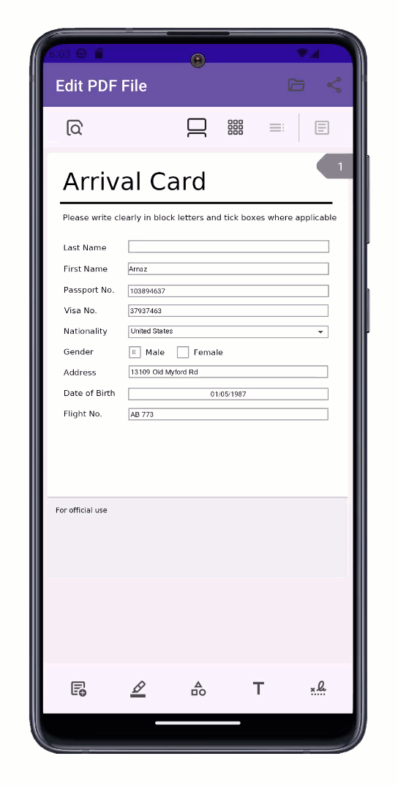

<!-- default badges list -->

<!-- default badges end -->

# Populate E-Forms in a PDF File 

This example uses the [PDFViewer](https://docs.devexpress.com/MAUI/DevExpress.Maui.Pdf.PdfViewer?v=24.1) component to display and edit a PDF document that contains interactive forms (AcroForms).

## Included Controls and Their Properties

* [ToolbarItem](https://learn.microsoft.com/en-us/dotnet/api/microsoft.maui.controls.toolbaritem)
* [PdfViewer](https://docs.devexpress.com/MAUI/404632/pdf-viewer/pdf-viewer?v=24.1): [DocumentSource](https://docs.devexpress.com/MAUI/DevExpress.Maui.Pdf.PdfViewer.DocumentSource?v=24.1)

## Files to Review

- [MainPage.xaml](./CS/Views/MainPage.xaml)
- [MainPage.xaml.cs](./CS/Views/MainPage.xaml.cs)

## Documentation

* [DevExpress PDF Viewer for .NET MAUI](https://docs.devexpress.com/MAUI/404632/pdf-viewer/pdf-viewer?v=24.1)
* [PDF Viewer for .NET MAUI - Load Document](https://docs.devexpress.com/MAUI/404712/pdf-viewer/load-document?v=24.1#load-a-pdf-file)
* [Fill in Interactive Forms in DevExpress PDF Viewer for .NET MAUI](https://docs.devexpress.com/MAUI/404953/pdf-viewer/interactive-forms?v=24.1)

## More Examples

* [DevExpress .NET MAUI Demo Center](https://github.com/DevExpress-Examples/maui-demo-app)
* [Stocks App](https://github.com/DevExpress-Examples/maui-stocks-mini)
* [Data Grid](https://github.com/DevExpress-Examples/maui-data-grid-get-started)
* [Data Form](https://github.com/DevExpress-Examples/maui-data-form-get-started)
* [Data Editors](https://github.com/DevExpress-Examples/maui-editors-get-started)
* [Charts](https://github.com/DevExpress-Examples/maui-charts)
* [Scheduler](https://github.com/DevExpress-Examples/maui-scheduler-get-started)
* [Tab Page](https://github.com/DevExpress-Examples/maui-tab-page-get-started)
* [Tab View](https://github.com/DevExpress-Examples/maui-tab-view-get-started)
* [Drawer Page](https://github.com/DevExpress-Examples/maui-drawer-page-get-started)
* [Drawer View](https://github.com/DevExpress-Examples/maui-drawer-view-get-started)
* [Collection View](https://github.com/DevExpress-Examples/maui-collection-view-get-started)
* [Popup](https://github.com/DevExpress-Examples/maui-popup-get-started)
